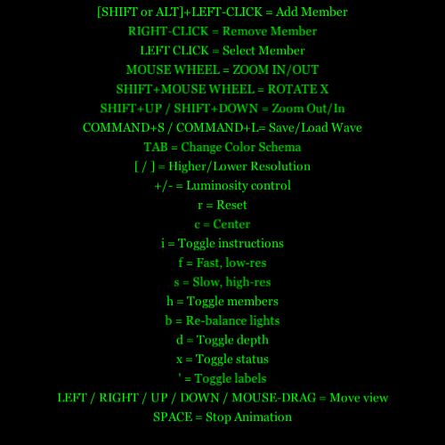
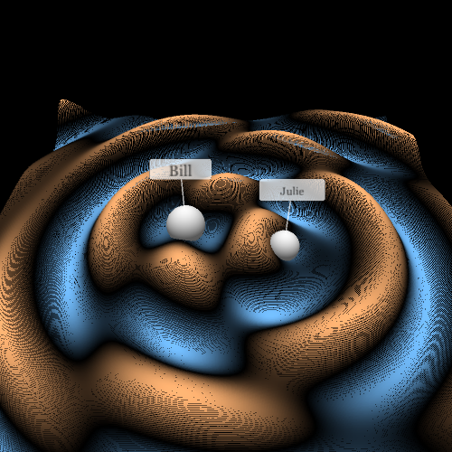
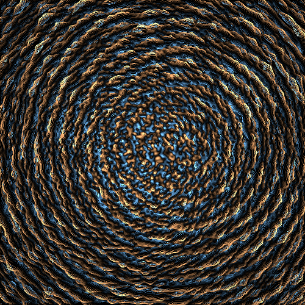
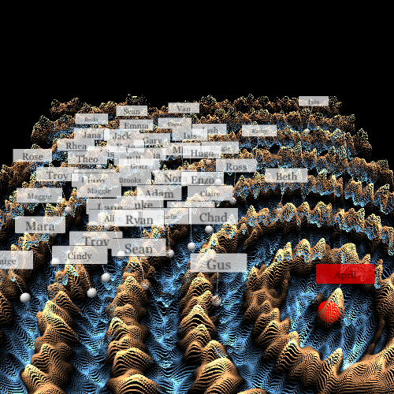
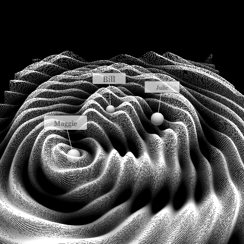
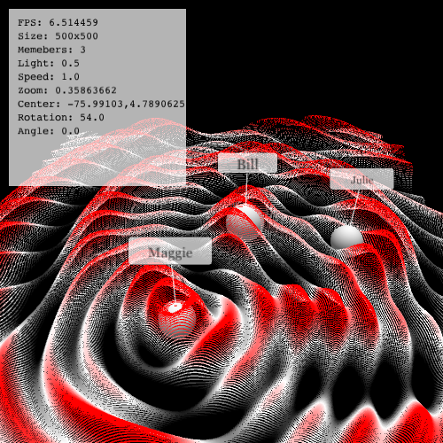
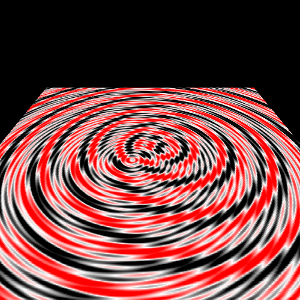

# Culture Waves
By Lorenzo Pasqualis - http://www.coderhood.com

Processing sketch designed to generate and render wave interference patterns. It is intended to visualize the analogy between such patterns and the culture of a company.

Each wave generator is given a random name. Wave generators can be dragged around the image, added, erased, etc. The wave pattern can be visualized in 3D or 2D in different color schemas. The view can be rotated around the X-axis, flattened, etc.

This sketch was written for the sole purpose of creating the imagery used [for an article about company culture on my CoderHood blog.](https://www.coderhood.com/visualizing-company-culture-and-cultural-change/)

Requires [Processing 3](https://processing.org/download/) to run.

## How to Run CultureWaves
1. Download and install [Processing 3](https://processing.org/download/).
2. Load this sketch and run it. You'll see a basic interference with 5 generators.
3. Press "i" to get a short list of commands that you can use (combination of mouse gestures and keys).

### Notes & Known Issues
- Known issue with selection of members when the view is rotated. Will fix it as some point if anybody cares. It has to do with determining the model coordinates of a mouse click on the Z=0 plane.
- You need a mouse with a wheel and a keyboard to run this properly.
- This sketch is not mobile-friendly.
- Instructions are **very** basic.

## Examples

### Animations:

### Static Screenshots:

## What to Do With It

- Add a few members by pressing [SHIFT]+[LEFT-MOUSE-CLICK].
- Click on them and move them around.
- Zoom using the mouse wheel (or [SHIFT]+[UP]/[DOWN]) and Drag the view around to explore (or use arrow keys).
- Change color schema with TAB.
- Press [SHIFT]+[Mouse wheel] to rotate.
- Press [H] to toggle hide members.
- Press [COMMAND/WIN/META]+[S] to save the wave.
- Press [COMMAND/WIN/META]+[L] to load a wave.
- Press [I] to get more instructions.

## LICENSE

MIT-License.

Permission is hereby granted, free of charge, to any person obtaining
a copy of this software and associated documentation files (the
"Software"), to deal in the Software without restriction, including
without limitation the rights to use, copy, modify, merge, publish,
distribute, sublicense, and/or sell copies of the Software, and to
permit persons to whom the Software is furnished to do so, subject to
the following conditions:

The above copyright notice and this permission notice shall be
included in all copies or substantial portions of the Software.

THE SOFTWARE IS PROVIDED "AS IS", WITHOUT WARRANTY OF ANY KIND,
EXPRESS OR IMPLIED, INCLUDING BUT NOT LIMITED TO THE WARRANTIES OF
MERCHANTABILITY, FITNESS FOR A PARTICULAR PURPOSE AND
NONINFRINGEMENT. IN NO EVENT SHALL THE AUTHORS OR COPYRIGHT HOLDERS BE
LIABLE FOR ANY CLAIM, DAMAGES OR OTHER LIABILITY, WHETHER IN AN ACTION
OF CONTRACT, TORT OR OTHERWISE, ARISING FROM, OUT OF OR IN CONNECTION
WITH THE SOFTWARE OR THE USE OR OTHER DEALINGS IN THE SOFTWARE.
